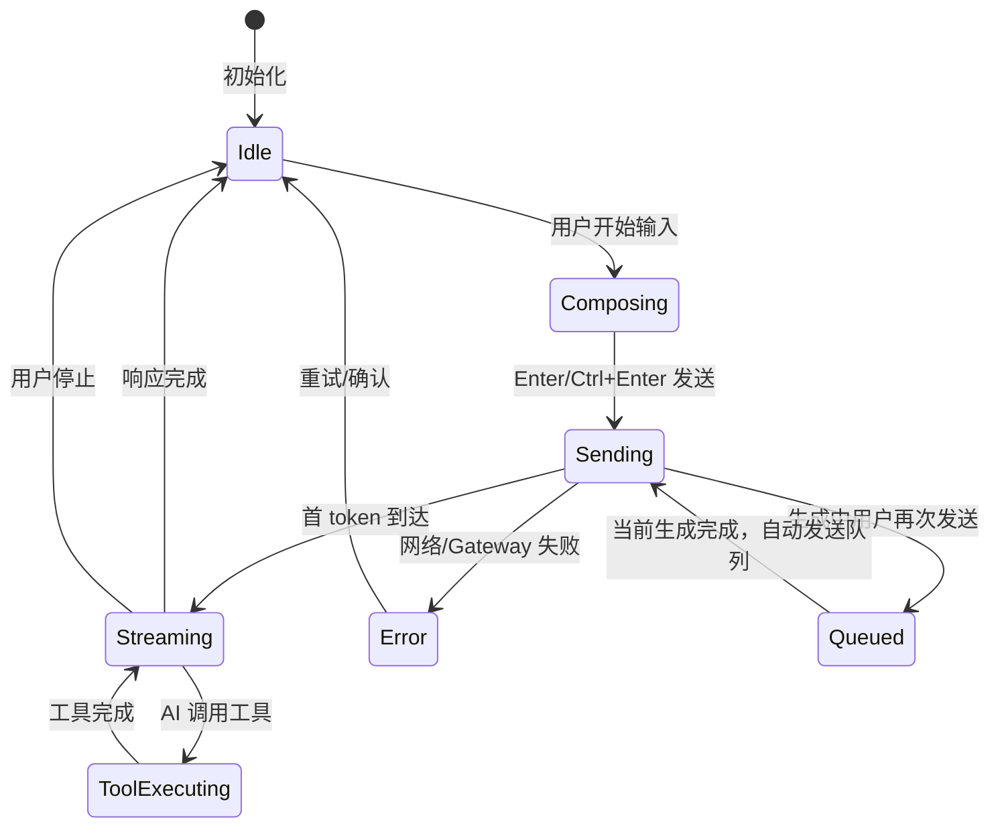
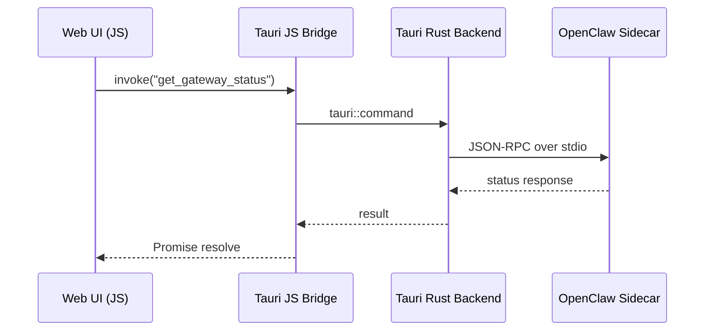
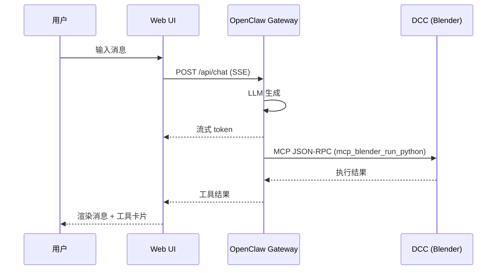

# Web UI 主界面结构设计 / Web UI Main Structure

> 范围：定义 Artifex Nexus **统一主界面**的信息架构 / 布局 / 区域划分 / 交互 / 状态机 / 对接点。
> 整合原 `apps/desktop` 全部功能。M3 结束后只有一个主界面。
> 设计令牌见 [[design-language]]，组件见 [[component-inventory]]。

---

## 1. 整体布局

三栏结构 + 顶栏。全局划分为 4 个一级区域（A/B/C/D）：

```
┌──────────────────────────────────────────────────────────────────┐
│                          A: 顶栏                                  │
├────────┬─────────────────────────────────────────┬───────────────┤
│        │                                         │               │
│   B:   │              C: 中央内容区               │    D: 右侧    │
│  左侧  │                                         │    面板区     │
│  导航  │     （根据 B 选中模块渲染不同内容）       │               │
│        │                                         │               │
│        │                                         │               │
│        │                                         │               │
└────────┴─────────────────────────────────────────┴───────────────┘
```

### 1.1 区域规格

| 区域 | ID | 默认尺寸 | 可调 | 说明 |
|------|-----|---------|------|------|
| 顶栏 | A | 高 40px | 否 | 全宽固定 |
| 左侧导航 | B | 宽 200px（展开）/ 48px（折叠） | 可折叠 | 模块入口 |
| 中央内容 | C | flex: 1 | 否（自适应） | 主体内容 |
| 右侧面板 | D | 宽 320px | 拖拽 240–640px / 可隐藏 | 辅助面板 |

### 1.2 响应式

| 窗口宽度 | 变化 |
|---------|------|
| ≥ 1280px | A/B/C/D 全部展开 |
| 1024–1279px | D 默认隐藏 |
| 768–1023px | B 折叠为图标，D 隐藏 |
| < 768px | B 隐藏（汉堡菜单），D 隐藏 |

---

## 2. A 区域：顶栏

顶栏为全宽工具条，功能参考 VS Code 标题栏/工具栏。

```
┌──────────────────────────────────────────────────────────────────┐
│ A1         │          A2            │           A3                │
│ 菜单区      │      搜索区             │        控制区              │
└──────────────────────────────────────────────────────────────────┘
```

### A1：菜单区（左侧）

| 元素 | 说明 |
|------|------|
| Logo 图标 | Artifex Nexus 品牌标识，点击回到 Chat |
| 汉堡菜单（窄屏） | < 768px 时显示，展开左侧导航 |

### A2：搜索区（居中）

| 元素 | 说明 |
|------|------|
| 搜索输入框 | 全局搜索：Skill / Tool / 文件 / 对话 / 设置项 |
| 快捷键提示 | 框内灰字显示 `Ctrl+K` |
| 搜索结果 | 下拉浮层，按类别分组（Skill / Tool / File / Conversation） |

### A3：控制区（右侧）

| 元素 | 说明 |
|------|------|
| 状态指示 | ● Gateway状态 + ● DCC连接数（彩色圆点） |
| Gateway 启动按钮 | Gateway 未运行时显示 `[▶ 启动]`，运行中隐藏 |
| 右侧面板开关 | 按钮，切换 D 区域显示/隐藏 |
| 通知铃铛 | 系统通知入口（安装完成/错误等） |

> **2026-05-09 调整**：用户头像和设置入口从 A3 移至 B2 区域下方（新增 B3 区域），参考 VS Code 布局。

---

## 3. B 区域：左侧导航栏

竖向模块入口列表。展开时显示图标+文字，折叠时仅图标（hover tooltip）。

```
┌──────────────┐
│ B1: 模块列表  │
│              │
│  💬 Chat     │
│  🧩 技能     │
│  🖥️ 系统     │
│  ⚙️ 设置     │
│              │
├──────────────┤
│ B1-自定义     │  ← 新增：用户自定义连接/工具
│  🔗 链接1    │
│  📁 目录1    │
│  📄 文件1    │
│  ▶ 脚本1     │
│  [+ 添加]    │
├──────────────┤
│ B2: 底部操作  │
│  [« 折叠]    │
├──────────────┤
│ B3: 用户区    │  ← 新增：用户头像 + 设置
│  👤 头像     │
│  ⚙ 设置      │
└──────────────┘
```

### B1：模块列表

| 图标 | 名称 | 点击后 C 区域渲染 |
|------|------|-----------------|
| 💬 | Chat | Chat 对话界面（§4） |
| 🧩 | 技能 | 技能管理页（§5） |
| 🖥️ | 系统 | 系统管理页（§6） |
| ⚙️ | 设置 | 全局设置页（§7） |

- 当前激活项高亮（背景色 accent）
- 各项可显示数字角标（如技能模块显示 Skill 总数）

### B1-自定义：自定义连接/工具（新增）

位于 B1 模块列表下方，作为独立分组。用户可添加自定义快捷入口：

| 类型 | 图标 | 点击行为 |
|------|------|---------|
| 网页链接 | 🔗 | 在系统浏览器打开 URL |
| 文件目录 | 📁 | 打开系统资源管理器（Windows Explorer / Finder） |
| 文件 | 📄 | 用关联软件打开文件 |
| 脚本 | ▶ | 快速运行脚本（Python / Shell / Batch） |

**操作**：
- **[+ 添加]** 按钮 → 弹出添加对话框：选择类型 + 输入名称 + 输入路径/URL
- 右键菜单：编辑 / 删除 / 复制路径
- 拖拽排序
- 数据持久化到 `~/.artifexnexus/config/quick-links.json`

### B2：底部操作

| 元素 | 说明 |
|------|------|
| 折叠按钮 | 切换 B 区域展开/折叠状态 |

### B3：用户区（新增）

位于 B 区域最底部，参考 VS Code 账户区布局。

| 元素 | 说明 |
|------|------|
| 用户头像 | 预留（远期账户体系），点击可切换账户/登录 |
| 设置齿轮 | ⚙ 图标，点击跳转到设置模块 |

---

## 4. C 区域 · Chat 模块

当 B 选中 💬 Chat 时，C 区域渲染对话界面。内部划分为 3 个子区域：

```
┌───────────────────────────────────────────────────┐
│                   C1: 对话控制栏                    │
├───────────────────────────────────────────────────┤
│                                                   │
│                   C2: 消息流                       │
│                                                   │
│                                                   │
├───────────────────────────────────────────────────┤
│                   C3: 输入区                       │
└───────────────────────────────────────────────────┘
```

### C1：对话控制栏

位于中央区域顶部，属于 Chat 模块内部（非全局顶栏）。

```
┌───────────────────────────────────────────────────┐
│ C1a         │ C1b      │ C1c                     │
│ Agent选择    │ Model选择 │ 对话管理                │
└───────────────────────────────────────────────────┘
```

| 区块 | 元素 | 说明 |
|------|------|------|
| C1a | Agent 下拉 | 选择 agent 预设（Artifex Nexus / 自定义） |
| C1b | Model 下拉 | 选择 LLM 模型（gpt-4o / deepseek-chat / ...） |
| C1c | 对话下拉 | 当前对话名称，下拉可搜索/切换/重命名/删除 |

> **2026-05-09 调整**：C1d（[+ 新对话] 按钮）移至 C3a 快捷操作栏。

### C2：消息流

垂直滚动的消息列表。每条消息是一张**消息卡片**：

**用户消息卡片结构**：

```
┌─────────────────────────────────────────┐
│ C2-U-a │         C2-U-b                 │
│ 头像    │  消息正文（纯文本/Markdown）     │
│        │                                │
│        │  C2-U-c: 附件区（可选）          │
└─────────────────────────────────────────┘
```

| 区块 | 说明 |
|------|------|
| C2-U-a | 用户头像 |
| C2-U-b | 消息正文（支持 Markdown 渲染） |
| C2-U-c | 附件列表（图片缩略图/文件图标），无附件时不显示 |

**AI 消息卡片结构**：

```
┌─────────────────────────────────────────┐
│ C2-A-a │         C2-A-b                 │
│ 头像    │  消息正文（Markdown + 代码高亮） │
│        │                                │
│        │  C2-A-c: 工具执行卡片（可选）    │
│        │  ┌───────────────────────────┐ │
│        │  │ C2-A-c1: 工具名 + 状态    │ │
│        │  │ C2-A-c2: 代码（可折叠）   │ │
│        │  │ C2-A-c3: 输出（可折叠）   │ │
│        │  └───────────────────────────┘ │
│        │                                │
│        │  C2-A-d: 操作栏                 │
└─────────────────────────────────────────┘
```

| 区块 | 说明 |
|------|------|
| C2-A-a | AI 头像（Artifex Nexus Logo） |
| C2-A-b | 消息正文（Markdown 渲染 + 代码块语法高亮） |
| C2-A-c | 工具执行卡片（0 到 N 个），无工具调用时不显示 |
| C2-A-c1 | 工具名（如 `mcp_blender_run_python`）+ 执行状态（⏳/✅/❌）+ 耗时 |
| C2-A-c2 | 发送给工具的代码/参数，默认折叠，点击展开 |
| C2-A-c3 | 工具返回的输出/结果，默认折叠，点击展开 |
| C2-A-d | 操作栏：复制 / 重新生成 / 点赞 / 点踩 |

**工具执行卡片折叠规则（2026-05-09 新增）**：

当一条 AI 消息包含 **≥ 3 个工具调用** 时，工具执行卡片默认折叠为摘要行：

```
┌─────────────────────────────────────────┐
│ 🔧 工具调用 (3)  [展开 ▼]               │  ← 折叠态：显示工具数量
│   ✅ mcp_blender_run_python (0.3s)      │
│   ✅ mcp_blender_run_python (0.2s)      │
│   ⏳ mcp_blender_run_python ...         │
└─────────────────────────────────────────┘
```

展开后显示完整卡片（每个工具独立卡片，含代码和输出）。用户可手动折叠/展开。
< 3 个工具调用时默认展开。

### C3：输入区

```
┌───────────────────────────────────────────────────┐
│ C3-文件区: 会话文件（Session Files）                │  ← 新增
│ 📄 scene.blend (新建)  📄 material.py (修改)       │
├───────────────────────────────────────────────────┤
│ C3-钉选区: 已 @提及 的 Tool/Skill 标签              │  ← 新增
│ [🧩 blender-modeling ×]  [🔧 create_cube ×]        │
├───────────────────────────────────────────────────┤
│ C3a: 快捷操作栏                                    │
│ [📎 附件]  [@提及]  [/ 命令]  [+ 新对话]           │
├───────────────────────────────────────────────────┤
│ C3b: 输入框                              │ C3c    │
│ ┌─────────────────────────────────────┐  │       │
│ │ 输入消息... (Shift+Enter 换行)      │  │ 发送  │
│ └─────────────────────────────────────┘  │ 恢复  │
│                                         │ 停止  │
│                                         │ [▼]   │  ← 发送方式切换
└───────────────────────────────────────────────────┘
```

### C3-文件区：会话文件 / Session Files（新增）

位于 C3a 上方，显示当前对话中 AI 操作过的文件列表。与右侧 D5 文件预览面板联动。

| 元素 | 说明 |
|------|------|
| 文件条目 | 文件名 + 操作类型标签（新建/修改/删除） |
| 点击行为 | 在 D5 文件预览面板中显示文件内容 |
| 数据来源 | AI 工具调用返回的文件操作记录（`file_create` / `file_modify` / `file_delete`） |
| 空状态 | 无文件操作时隐藏此区域 |

### C3-钉选区：@提及标签栏（新增）

位于 C3a 上方，显示当前输入框中已 @提及 的 Tool/Skill 标签。

| 元素 | 说明 |
|------|------|
| 标签 | `[图标 名称 ×]` 形式，点击 × 取消提及 |
| 来源 | 用户在输入框输入 `@` 后从弹出选择器中选中 |
| 行为 | 发送消息时，标签对应的 Tool/Skill 上下文随消息一起发送给 AI |
| 空状态 | 无 @提及 时隐藏此区域 |

### C3a：快捷操作栏

| 按钮 | 说明 |
|------|------|
| 📎 附件 | 上传文件（图片/代码/模型文件），显示在 C2-U-c 附件区 |
| @ 提及 | 弹出 Tool/Skill 选择器（搜索 + 列表），选中后在输入框插入 `@tool_name` 并在 C3-钉选区显示标签 |
| / 命令 | 弹出命令面板（/clear / /retry / /export 等） |
| [+ 新对话] | 新建空白对话（从原 C1d 移入） |

**@ 提及选择器行为**：
- 输入 `@` 触发弹出（或点击 @ 按钮）
- 弹出浮层：搜索框 + Tool/Skill 列表（按最近使用排序）
- 选中后：输入框插入 `@tool_name` 文本标记，C3-钉选区显示对应标签
- 语义：快速提及插入，非钉选面板。发送时附带 tool 上下文给 AI

### C3b：输入框

多行输入框（Textarea），支持自适应高度（80px–200px）。

### C3c：发送区

| 按钮 | 状态 | 说明 |
|------|------|------|
| **停止** | 常驻 | 生成中高亮红色，空闲时灰显 |
| **发送** | 默认 | Enter 或 Ctrl+Enter 发送消息 |
| **发送方式切换 [▼]** | 始终 | 下拉切换 Enter 发送 / Ctrl+Enter 发送 |

**队列行为**（自动）：
- AI 正在生成回复时，用户按发送 → 消息自动进入队列
- 队列消息在 C3 上方以信息队列区显示
- 当前回复完成后，自动发送队列中的第一条消息
- 恢复功能为自动：停止后用户再次发送即自动恢复

### 对话状态机



**新增状态说明**：

| 状态 | 说明 |
|------|------|
| Queued | 生成中用户按发送，消息自动进入队列等待 |

---

## 5. C 区域 · 技能模块

当 B 选中 🧩 技能时，C 区域渲染技能管理页。内部用 Tab 栏划分子页面：

```
┌───────────────────────────────────────────────────┐
│ C-AB1: Tab 栏                                      │
│ [Skill]  [Tool]  [Workflow]                        │
├───────────────────────────────────────────────────┤
│                                                   │
│ C-AB2: Tab 内容区                                  │
│                                                   │
└───────────────────────────────────────────────────┘
```

### 5.1 Skill Tab — C-AB2 内容

```
┌───────────────────────────────────────────────────┐
│ C-AB2-S1: 工具栏                                   │
│ [🔍 搜索]  [软件: 全部▼]  [来源: 全部▼]           │
│ [排序: 名称▼]  [📋 列表 / 🗂 卡片]  [+ 安装]      │
├───────────────────────────────────────────────────┤
│ C-AB2-S2: Skill 列表/卡片                          │
│                                                   │
│  ┌ Skill 卡片 ─────────────────────────────────┐  │
│  │ [□]  ← 批量选择（hover/选中时显示）          │  │
│  │ S-a │ S-b              │ S-e │ S-f          │  │
│  │ 图标 │ 名称              │ 官方 │ 已安装      │  │
│  │     │ DCC标签(可选)     │     │              │  │
│  ├──────┴──────────────────┴─────┴──────────────┤  │
│  │ S-d: 描述 (1~2行)                            │  │
│  │                                              │  │
│  ├──────────────────────────────────────────────┤  │
│  │ S-g: 元信息行                                 │  │
│  │ v1.2.3 · 作者 · 2026-05-08                     │  │
│  ├──────────────────────────────────────────────┤  │
│  │ S-c: 操作按钮组                               │  │
│  │ [详情] [安装]/[卸载] [启用]/[禁用] [更新]     │  │
│  │ [发布] [钉选] [收藏]                            │  │
│  └──────────────────────────────────────────────┘  │
│                                                   │
│  ┌ Skill 列表行 ───────────────────────────────┐  │
│  │ [□] │ S-a │ S-b │ S-e │ S-f │ S-g           │  │
│  │     │ 图标 │ 名称 │ 官方 │已安装│ 元信息      │  │
│  ├─────┴─────┴─────┴─────┴─────┴───────────────┤  │
│  │ S-d: 描述 (1行)          │ S-c: [详情][...] │  │
│  └─────────────────────────────────────────────┘  │
└───────────────────────────────────────────────────┘
```

**Skill 卡片/列表项区块说明**：

| 编号 | 区块 | 说明 |
|------|------|------|
| — | □ | 批量选择复选框（hover 或已选中时显示） |
| S-a | 图标 | 按 DCC 软件区分，使用字母图标：**B**lender(橙) / **M**aya(青) / **3**ds Max(黄) / **U**nreal(天蓝) / **H**oudini(琥珀) / **C**omfyUI(紫) / **G**eneral(灰) |
| S-b | 名称 | 粗体，可选附带 DCC 标签（如 `Blender, Maya`） |
| S-e | 来源 | `官方` / `市集` / `我的`（对应 `official` / `marketplace` / `user`） |
| S-f | 状态 | `已安装`(绿) / `可安装`(灰) / `有更新`(黄) / `已禁用`(红) |
| S-d | 描述 | 1~2 行，来自 manifest.description |
| S-g | 元信息 | 版本号 · 作者 · 修改日期（列表模式与 S-a/S-b/S-e/S-f 同行） |
| S-c | 操作按钮 | 根据状态动态显示（见下方按钮表） |

**操作按钮（按状态动态显示）**：

| Skill 状态 | 按钮 |
|-----------|------|
| `not_installed` | `[详情]` `[安装]` `[收藏]` |
| `installed` | `[详情]` `[卸载]` `[禁用]` `[钉选]` `[收藏]` |
| `update_available` | `[详情]` `[卸载]` `[更新]` `[钉选]` `[收藏]` |
| `disabled` | `[详情]` `[卸载]` `[启用]` `[钉选]` `[收藏]` |
| `user` 来源额外 | `[发布]` |

**同步状态附加按钮**（与上述按钮并列显示）：

| 同步状态 | 附加按钮 |
|---------|---------|
| `source_newer`（源码有更新） | `[更新]`（从源码同步） |
| `installed_newer` / `modified` / `no_source` | `[发布]` |
| `conflict`（冲突） | `[更新]`（用源码覆盖） `[发布]` |

**详情界面**：点击 `[详情]` → **弹出模态窗口**（Dialog），包含：
- 完整描述、版本历史、依赖信息
- `[打开源码目录]` — 在资源管理器中打开 Skill 源码路径
- `[打开安装目录]` — 在资源管理器中打开 Skill 安装路径

**钉选**：钉选的 Skill 在 C3-钉选区常驻显示，方便快速 @提及。

**筛选器**：

| 筛选维度 | 选项 | 说明 |
|---------|------|------|
| 软件 | 全部 / Blender / Maya / Max / Unreal / Houdini / ComfyUI | 按 targetDCCs 过滤 |
| 来源 | 全部 / 官方 / 市集 / 我的 | 按 source 过滤 |
| 状态 | 全部 / 已安装 / 可安装 / 有更新 / 已禁用 | 按 status 过滤 |
| 收藏 | ⭐ 切换 | 仅显示已收藏 |
| 排序 | 默认收藏优先，其次按名称 | |

**视图切换**：📋 列表 / 🗂 卡片 按钮切换显示模式，状态持久化到 localStorage。

**批量操作**：选中多个 Skill 后，底部浮现 `BatchActionBar`：`[批量安装]` `[批量卸载]` `[批量启用]` `[批量禁用]`。

### 5.2 Tool Tab — C-AB2 内容

Tool 页面结构与 Skill 完全一致，复用同一套卡片/列表组件，仅操作按钮不同。

```
┌───────────────────────────────────────────────────┐
│ C-AB2-T1: 工具栏                                   │
│ [🔍 搜索]  [软件: 全部▼]  [来源: 全部▼]           │
│ [排序: 名称▼]  [📋 列表 / 🗂 卡片]  [+ 创建]      │
├───────────────────────────────────────────────────┤
│ C-AB2-T2: Tool 列表/卡片（按 Skill 分组折叠）       │
│                                                   │
│  ▼ blender-modeling (3 tools)     ← Skill 分组头  │
│  ┌ Tool 卡片 ─────────────────────────────────┐  │
│  │ [□]                                        │  │
│  │ T-a │ T-b              │ T-e │ T-f         │  │
│  │ 图标 │ 函数名            │ 官方 │ 已安装     │  │
│  │     │ [包装]/[脚本]/[组合]│     │            │  │
│  ├──────┴──────────────────┴─────┴─────────────┤  │
│  │ T-d: 描述 (1~2行)                           │  │
│  │                                              │  │
│  ├──────────────────────────────────────────────┤  │
│  │ T-g: 元信息行                                │  │
│  │ v1.2.3 · 作者 · 2026-05-08                    │  │
│  │ ⚡ 事件/定时                                   │  │
│  ├──────────────────────────────────────────────┤  │
│  │ T-c: 操作按钮组                              │  │
│  │ [详情] [运行] [收藏]                          │  │
│  │ [发布] [删除]（仅 user 来源）                 │  │
│  └──────────────────────────────────────────────┘  │
│                                                   │
│  ▶ ue-blueprint (5 tools)  ← 折叠状态             │
└───────────────────────────────────────────────────┘
```

**Tool 卡片/列表项区块说明**：

| 编号 | 区块 | 说明 |
|------|------|------|
| — | □ | 批量选择复选框 |
| T-a | 图标 | 与所属 Skill 一致，按 DCC 软件区分 |
| T-b | 名称 | 函数名（粗体）+ 实现类型标签：`包装`(skill_wrapper) / `脚本`(script) / `组合`(composite) |
| T-e | 来源 | `官方` / `市集` / `我的`（继承自所属 Skill） |
| T-f | 状态 | `已安装`(绿) / `可安装`(灰) / `有更新`(黄) |
| T-d | 描述 | docstring 首行 + 参数签名摘要，1~2 行 |
| T-g | 元信息 | 版本 · 作者 · 修改日期 · ⚡触发类型 |
| T-c | 操作按钮 | 根据状态和来源动态显示（见下方按钮表） |

**操作按钮（按状态动态显示）**：

| Tool 状态 | 按钮 |
|----------|------|
| `not_installed` | `[详情]` `[安装]` `[收藏]`（user 来源无安装按钮） |
| `installed` | `[详情]` `[运行]` `[收藏]`（user 来源额外：`[发布]` `[删除]`） |
| `update_available` | `[详情]` `[运行]` `[更新]` `[收藏]` |

**运行按钮**：点击 `[运行]` → 自动跳转到 Chat 面板，预输入 `请帮我运行工具 "xxx"` 到输入框（不自动发送）。

**@提及 Tool**：在 Chat 输入区点击 @ 选择 Tool → 预输入 `请帮我运行工具 "xxx"` 到输入框。

**@提及 Skill**：在 Chat 输入区点击 @ 选择 Skill → 钉选到 C3-钉选区。

**筛选器**（与 Skill 一致）：

| 筛选维度 | 选项 | 说明 |
|---------|------|------|
| 软件 | 全部 / Blender / Maya / Max / Unreal / Houdini / ComfyUI | 按所属 Skill 的 targetDCCs 过滤 |
| 来源 | 全部 / 官方 / 市集 / 我的 | 按所属 Skill 的 source 过滤 |
| 排序 | 名称 / 最近更新 / 最近使用 | 默认按名称 |

**批量操作**：选中多个 Tool 后，底部浮现 `ToolsBatchActionBar`：`[批量运行]` `[批量删除]`。

**Skill/Tool 卡片组件复用**：

Skill 和 Tool 使用同一套 `ItemCard` / `ItemListRow` 组件，通过 props 区分：

| Prop | Skill 值 | Tool 值 |
|------|---------|---------|
| `icon` | targetDCCs → DCC 图标 | 继承所属 Skill 图标 |
| `title` | name | 函数名 |
| `titleBadge` | DCC 标签 | 实现类型标签（包装/脚本/组合） |
| `description` | manifest.description | docstring 首行 |
| `source` | `official` / `marketplace` / `user` | 继承所属 Skill |
| `status` | `not_installed` / `installed` / `update_available` / `disabled` | `not_installed` / `installed` / `update_available` |
| `meta` | 版本·作者·修改日期 | 版本·作者·修改日期·触发类型 |
| `actions` | 详情/安装/卸载/启用/禁用/更新/发布/钉选/收藏 | 详情/安装/运行/收藏/发布/删除/更新 |
| `favorited` | 是否已收藏 | 是否已收藏 |
| `pinned` | 是否已钉选 | — |

### 5.3 Workflow Tab（M8 占位）

- 居中占位文案："Workflow 管理将在 M8 阶段启用"
- 简单图标 + 说明

---

## 6. C 区域 · 系统模块

当 B 选中 🖥️ 系统时，C 区域渲染系统管理页。整合原 Desktop 的安装向导和 Gateway 控制。

```
┌───────────────────────────────────────────────────┐
│ C-SYS1: Tab 栏                                     │
│ [安装向导]  [Gateway]  [运行状态]                    │
├───────────────────────────────────────────────────┤
│                                                   │
│ C-SYS2: Tab 内容区                                 │
│                                                   │
└───────────────────────────────────────────────────┘
```

### 6.1 安装向导 Tab

直接复用现有安装向导组件逻辑，布局如下：

```
┌───────────────────────────────────────────────────┐
│ C-SYS2-I1: 顶部工具条                              │
│ "Artifex Nexus · 安装向导"         [全局检测]       │
├───────────────────────────────────────────────────┤
│ C-SYS2-I2: 安装清单                                │
│                                                   │
│  ┌ 安装项卡片 ─────────────────────────────────┐  │
│  │ I-a │ I-b         │ I-c   │ I-d            │  │
│  │ 图标 │ 名称+版本   │ 状态   │ 操作按钮组     │  │
│  │     │ I-e: 子项数  │       │                │  │
│  └─────────────────────────────────────────────┘  │
│                                                   │
│  ▼ 展开后的子项列表                                 │
│  ┌ 子项行 ─────────────────────────────────────┐  │
│  │ I-f: 标签+版本 │ I-g: 路径 │ I-h: 状态+操作 │  │
│  └─────────────────────────────────────────────┘  │
│                                                   │
├───────────────────────────────────────────────────┤
│ C-SYS2-I3: 日志面板（可折叠）                       │
│ [▾ 折叠] [⊟ 清屏]                                 │
│ [12:30:01] INFO openclaw: 已安装                   │
│ [12:30:02] INFO blender: 检测到 2 版本             │
└───────────────────────────────────────────────────┘
```

**安装项卡片区块**：

| 区块 | 说明 |
|------|------|
| I-a | 品牌图标（16×16） |
| I-b | 显示名称 + 版本号 |
| I-c | 状态徽章（installed/not-installed/installing/failed/pending/unavailable） |
| I-d | 操作按钮：检测 / 设置 / 安装（根据状态禁用） |
| I-e | 子项统计："已装 2 · 可用 3"（仅可展开项显示） |
| I-f | 子项标签（如 "Blender 4.2"）+ 版本 |
| I-g | 安装路径 |
| I-h | 子项状态 + 操作（安装/卸载/更新） |

### 6.2 Gateway Tab

```
┌───────────────────────────────────────────────────┐
│ C-SYS2-G1: Gateway 状态卡片                        │
│  ┌─────────────────────────────────────────────┐  │
│  │ G-a: 状态头                                  │  │
│  │ ● 运行中 / ○ 未运行 / ⚠ 异常                 │  │
│  │                                             │  │
│  │ G-b: 元数据                                  │  │
│  │ PID: 12345  端口: 19789  启动: 2026-05-09    │  │
│  │                                             │  │
│  │ G-c: 错误信息（仅异常时）                     │  │
│  │ 最后错误: connect ECONNREFUSED              │  │
│  │                                             │  │
│  │ G-d: 操作按钮                                │  │
│  │ [▶ 启动/↻ 重启]  [🌐 OpenClaw Web UI]       │  │
│  └─────────────────────────────────────────────┘  │
├───────────────────────────────────────────────────┤
│ C-SYS2-G2: Gateway 日志面板                        │
│  ┌─────────────────────────────────────────────┐  │
│  │ G2-a: 日志工具栏                             │  │
│  │ [▾ 折叠]  [⛶ 全屏]  [⊟ 清屏]               │  │
│  ├─────────────────────────────────────────────┤  │
│  │ G2-b: 日志内容                               │  │
│  │ 18:30:01 INFO  Gateway started              │  │
│  │ 18:30:02 INFO  Plugin loaded                │  │
│  ├─────────────────────────────────────────────┤  │
│  │ G2-c: 日志底栏                               │  │
│  │ 共 42 行（窗口最多 200）                      │  │
│  └─────────────────────────────────────────────┘  │
└───────────────────────────────────────────────────┘
```

| 区块 | 说明 |
|------|------|
| G-a | 状态指示：彩色圆点 + 文字（运行中/未运行/异常） |
| G-b | 元数据行：PID · 端口 · 启动时间 |
| G-c | 错误横幅（仅 state=errored 时显示） |
| G-d | 操作按钮：启动或重启（根据状态）+ 打开 OpenClaw Web UI（仅运行时可用） |
| G2-a | 日志工具栏：折叠/全屏/清屏按钮 |
| G2-b | 日志内容（自动滚动到底，手动滚动时暂停粘底） |
| G2-c | 统计行：当前行数 + 丢弃警告 |

### 6.3 运行状态 Tab

```
┌───────────────────────────────────────────────────┐
│ C-SYS2-R1: Sidecar 状态卡片                        │
│  ┌─────────────────────────────────────────────┐  │
│  │ R1-a: 状态   R1-b: 端口   R1-c: HOME 路径   │  │
│  │ ● 运行中     19789       ~/.artifexnexus/   │  │
│  └─────────────────────────────────────────────┘  │
├───────────────────────────────────────────────────┤
│ C-SYS2-R2: DCC 连接列表                            │
│  ┌ DCC 连接行 ─────────────────────────────────┐  │
│  │ R2-a │ R2-b          │ R2-c  │ R2-d        │  │
│  │ 状态点│ 名称+版本     │ 地址   │ 延迟/操作   │  │
│  └─────────────────────────────────────────────┘  │
├───────────────────────────────────────────────────┤
│ C-SYS2-R3: 部署校验摘要                            │
│  ✅ 3 正常  🔄 1 可更新  ⚠️ 0 损坏  ❌ 0 缺失    │
└───────────────────────────────────────────────────┘
```

| 区块 | 说明 |
|------|------|
| R1-a | Sidecar 运行状态圆点 + 文字 |
| R1-b | Sidecar 监听端口 |
| R1-c | OPENCLAW_HOME 路径 |
| R2-a | DCC 连接状态圆点（绿=在线/灰=离线） |
| R2-b | DCC 名称 + 版本（如 "Blender 4.2"） |
| R2-c | 连接地址（127.0.0.1:9876） |
| R2-d | 延迟/操作按钮（断开/重连） |
| R3 | 部署文件校验汇总（正常/可更新/损坏/缺失数量） |

---

## 7. C 区域 · 设置模块

当 B 选中 ⚙️ 设置时，C 区域渲染设置页面。内部左右分栏：

```
┌───────────────────────────────────────────────────┐
│ C-SET1: 分类导航  │  C-SET2: 设置内容              │
│                  │                                │
│  ▸ 常规           │  （选中分类的详细内容）          │
│  ▸ 模型           │                                │
│  ▸ 认证           │                                │
│  ▸ Agent 预设     │                                │
│  ▸ DCC 连接       │                                │
│  ▸ 路径           │                                │
│  ▸ 快捷键         │                                │
│  ▸ 关于           │                                │
└───────────────────────────────────────────────────┘
```

### 7.1 设置分类内容

| 分类 | C-SET2 渲染内容 | 原 Desktop 来源 |
|------|----------------|----------------|
| 常规 | 主题切换（深/浅/系统）+ 字体大小 + 语言 | 新增 |
| 模型 | Provider 列表管理 + API Key + 默认模型下拉 + [测试连接] | 原 SettingsPanel ProvidersTab |
| 认证 | Auth Profile 列表管理（高级模式开关） | 原 SettingsPanel AuthProfilesTab |
| Agent 预设 | 默认 Agent 名称/描述/system prompt 编辑 + [重置预设] | 原 SettingsPanel DefaultAgentTab |
| DCC 连接 | 已配置 DCC 实例列表 + 端口 + 路径 + [添加] | 原 Settings.tsx + 新增 |
| 路径 | 安装路径 / 数据目录 / 日志位置（只读展示 + 修改按钮） | 原 Settings.tsx |
| 快捷键 | 快捷键绑定表格 + 编辑（M3 占位） | 新增 |
| 关于 | 版本号 + 构建信息 + [检查更新] + 开源协议链接 | 新增 |

---

## 8. D 区域：右侧面板

堆叠式可展开面板（类 VS Code Explorer）。整体可隐藏，内部各面板独立折叠。

```
┌──────────────────────────┐
│ D1: 最近使用              │
├──────────────────────────┤
│ D2: Skill 列表           │
├──────────────────────────┤
│ D3: Tool 列表            │
├──────────────────────────┤
│ D4: 资源管理器            │
├──────────────────────────┤
│ D5: 文件预览              │
└──────────────────────────┘
```

各面板之间的分隔线可拖拽调整高度比例。

### D1：最近使用

```
┌──────────────────────────┐
│ ▼ 最近使用         [⟳]   │  ← 标题 + 刷新按钮
├──────────────────────────┤
│  🧩 blender-modeling     │  ← Skill 条目
│  🔧 create_cube         │  ← Tool 条目
│  🔧 set_material        │
│  🧩 ue-blueprint        │
└──────────────────────────┘
```

| 元素 | 说明 |
|------|------|
| 条目 | 最近 10 项使用/查看过的 Skill + Tool，按时间倒序 |
| 点击行为 | Skill → 跳转技能模块详情；Tool → 在 Chat 插入 @提及 |
| 图标 | 🧩 = Skill, 🔧 = Tool |

### D2：Skill 列表

```
┌──────────────────────────┐
│ ▶ Skill 列表      (5)    │  ← 折叠状态，显示总数
└──────────────────────────┘

展开后：
┌──────────────────────────┐
│ ▼ Skill 列表      (5)    │
├──────────────────────────┤
│  ● blender-modeling v1.2 │  ← 绿点=启用
│    [📌 钉选]              │  ← 钉选按钮
│  ● ue-blueprint    v0.9  │
│    [📌 钉选]              │
│  ○ image-gen       v2.0  │  ← 灰点=禁用
│  ...                     │
└──────────────────────────┘
```

| 元素 | 说明 |
|------|------|
| 每行 | 状态点 + 名称 + 版本 + `[📌 钉选]` 按钮 |
| 点击名称 | 跳转到技能模块对应 Skill 详情 |
| 钉选 | 钉选的 Skill 在 C3-钉选区常驻显示 |
| 右键 | 上下文菜单（启用/禁用/配置/卸载） |

### D3：Tool 列表

```
┌──────────────────────────┐
│ ▶ Tool 列表       (12)   │  ← 折叠状态
└──────────────────────────┘

展开后（按 Skill 分组）：
┌──────────────────────────┐
│ ▼ Tool 列表       (12)   │
├──────────────────────────┤
│  ▼ blender-modeling      │  ← Skill 分组头
│    🔧 create_cube        │
│      [▶ 运行]            │  ← 运行按钮
│    🔧 set_material       │
│      [▶ 运行]            │
│    🔧 delete_object      │
│      [▶ 运行]            │
│  ▶ ue-blueprint          │  ← 折叠
└──────────────────────────┘
```

| 元素 | 说明 |
|------|------|
| 分组头 | Skill 名称，可展开/折叠 |
| Tool 行 | 图标 + 函数名 + `[▶ 运行]` 按钮 |
| 点击名称/运行 | 右侧 D 面板展开 Tool 参数输入表单 + 执行按钮 |
| 右键 | 上下文菜单（收藏/查看详情） |

### D4：资源管理器

```
┌──────────────────────────┐
│ ▼ 资源管理器              │
├──────────────────────────┤
│  📁 skills/              │
│  ├── 📁 blender-modeling │
│  │   ├── 📄 manifest.json│
│  │   ├── 📄 SKILL.md    │
│  │   └── 📄 __init__.py │
│  └── 📁 ue-blueprint    │
│      ├── 📄 manifest.json│
│      └── 📄 __init__.py │
└──────────────────────────┘
```

| 元素 | 说明 |
|------|------|
| 根目录 | `~/.artifexnexus/.openclaw/workspace/skills/` |
| 显示模式 | 列表视图（后续可加图标视图） |
| 点击文件 | D5 文件预览面板联动显示内容 |
| 点击文件夹 | 展开/折叠 |
| 与 Skill 关联 | 资源管理器中的文件夹对应 Skill，可快速定位 |

### D5：文件预览

```
┌──────────────────────────┐
│ ▼ 文件预览                │
├──────────────────────────┤
│ 📄 manifest.json         │  ← 当前预览文件名
│ ─────────────────────────│
│ {                        │
│   "name": "blender-...", │
│   "version": "1.2.0",   │
│   "tools": [...]         │
│ }                        │
└──────────────────────────┘
```

| 元素 | 说明 |
|------|------|
| 文件名 | 当前预览的文件路径/名称 |
| 内容区 | 根据文件类型渲染 |
| 支持格式 | `.md` → Markdown 渲染；`.py`/`.json`/`.ts` → 语法高亮；`.png`/`.jpg` → 图片缩略图 |
| 无选中时 | 灰字提示"在资源管理器或会话文件中选择文件以预览" |
| 联动 C3-文件区 | 点击 C3-文件区的文件条目 → D5 自动定位并预览 |

---

## 9. 导航层级总览

### 一级导航（B 区域模块）

```
Chat ─────────── 对话界面（默认入口）
技能 ─────────── 技能管理
  ├── Skill Tab
  ├── Tool Tab
  └── Workflow Tab (M8)
系统 ─────────── 系统管理（原 Desktop 功能）
  ├── 安装向导 Tab
  ├── Gateway Tab
  └── 运行状态 Tab
设置 ─────────── 全局配置
  ├── 常规
  ├── 模型
  ├── 认证
  ├── Agent 预设
  ├── DCC 连接
  ├── 路径
  ├── 快捷键 (M3 占位)
  └── 关于
```

### 跳转关系

| 触发位置 | 目标 | 条件 |
|---------|------|------|
| A1 Logo | Chat 模块 | 始终 |
| A2 搜索结果 | 对应模块/详情页 | 点击搜索结果项 |
| B1-自定义 链接 | 系统浏览器打开 URL | 点击 |
| B1-自定义 目录 | 系统资源管理器 | 点击 |
| B1-自定义 文件 | 关联软件打开 | 点击 |
| B1-自定义 脚本 | 运行脚本 | 点击 |
| B3 设置齿轮 | 设置模块 | 点击 |
| D1 最近使用 Tool | Chat 输入框 @提及 | 点击 |
| D1 最近使用 Skill | 技能模块 Skill 详情 | 点击 |
| D3 Tool 列表 | Chat 输入框 @提及 | 点击 |
| D4 资源管理器 | D5 文件预览 | 点击文件 |
| C3-文件区 文件条目 | D5 文件预览 | 点击 |
| C-SYS2-G-d OpenClaw Web UI | 系统浏览器打开 | Gateway 运行时 |
| Chat 工具卡片 Tool 名 | 技能模块 Tool 详情 | 点击 |

---

## 10. Desktop .exe 整合方案

### 整合前（当前）

Desktop 有独立路由/导航/组件，Web UI 空壳。

### 整合后（M3 目标）

```
Desktop .exe (Tauri)
├── 窗口管理（标题栏、窗口控制）
├── sidecar 生命周期（启动/停止 OpenClaw wrapper）
├── 系统托盘（可选）
└── WebView ── 加载 packages/apps/web 产物
    └── 统一 Web UI（本 spec 定义的全部功能）
```

### Tauri 桥接层



### 浏览器模式适配

Web UI 封装 platform adapter，同一套代码在两种环境运行：

| 功能 | Tauri 模式 | 浏览器模式 |
|------|-----------|-----------|
| Gateway 控制 | `invoke("start_gateway")` | HTTP → sidecar REST |
| 文件系统 | `invoke("read_file")` | sidecar REST API |
| 系统通知 | Tauri notification | Web Notification API |
| 窗口标题 | `appWindow.setTitle()` | `document.title` |

---

## 11. Chat 数据流



---

## 12. 验收清单

- [ ] 四区域布局（A/B/C/D）渲染正确
- [ ] A 区域搜索框可弹出搜索结果浮层
- [ ] B 区域四个模块可切换，折叠/展开正常
- [ ] B1-自定义：可添加/编辑/删除网页链接、目录、文件、脚本快捷入口
- [ ] B3 用户区：头像 + 设置齿轮渲染正确，点击设置跳转设置模块
- [ ] C-Chat 可输入消息并显示 mock 回复
- [ ] C-Chat 对话控制栏功能可操作
- [ ] C2-A-c 工具执行卡片：≥3 个工具时默认折叠，可展开
- [ ] C3-文件区：显示对话中操作的文件，点击联动 D5 预览
- [ ] C3-钉选区：@提及 后显示标签，可取消
- [ ] C3a @提及 弹出选择器：搜索 + 选中插入
- [ ] C3a [+ 新对话] 按钮可用
- [ ] C3c 发送/停止/恢复按钮状态切换正确
- [ ] C3c 发送方式切换：队列模式生成中发送 → 排队 → 自动发送
- [ ] C-技能 Tab 切换正常，Skill 卡片/列表可切换
- [ ] C-技能 筛选器：软件/来源/排序 三种筛选可用
- [ ] C-技能 Skill 卡片：图标按 DCC 区分，来源标签（官方/市集/我的），状态徽章（已安装/可安装/有更新/已禁用）
- [ ] C-技能 Skill 操作按钮按状态动态显示（安装/启用/禁用/钉选/卸载/更新/同步/发布/📂）
- [ ] C-技能 批量选择 + BatchActionBar 可用
- [ ] C-技能 Tool 卡片：与 Skill 复用同一组件，操作按钮不同（运行/详情/收藏/编辑/发布/删除/📂）
- [ ] C-技能 Tool 列表按 Skill 分组折叠
- [ ] C-技能 Tool 实现类型标签（包装/脚本/组合）显示正确
- [ ] C-技能 Tool 收藏功能可用
- [ ] C-系统 安装向导 Tab 功能与原 Desktop 一致
- [ ] C-系统 Gateway Tab 功能与原 Desktop 一致
- [ ] C-设置 分类导航可切换，模型/认证/Agent 内容与原功能一致
- [ ] D 区域可隐藏/显示，整体宽度可拖拽
- [ ] D 各面板可独立折叠/展开，面板间高度可拖拽
- [ ] D4 资源管理器点击文件联动 D5 预览
- [ ] D5 与 C3-文件区联动：点击会话文件 → D5 预览
- [ ] Desktop .exe 加载 Web UI 后功能无回退
- [ ] `pnpm -C packages/apps/web build` 通过
- [ ] `pnpm -C apps/desktop tauri build` 通过

---

## 相关

- [[design-language]] — 设计令牌
- [[component-inventory]] — 基础组件清单
- [[installer-structure]] — 安装向导原始 spec（组件逻辑保留）
